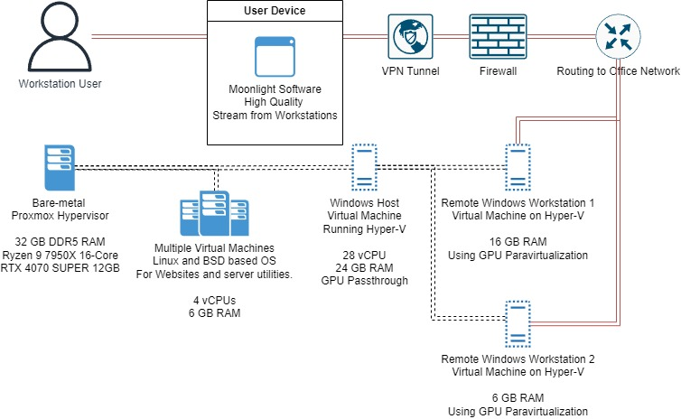

Last updated: Jul 6, 2025

My home lab started with building the infrastructure to run the game servers for the Beryllium multiplayer game I developed. Over time, I started running other services on the same servers, and it quickly transformed into a home lab.

Especially after starting my studies at Business College Helsinki, I have become more fascinated by data centers and the infrastructure around them. My home lab has helped me a lot in my IT studies, and I would say it has been a key factor in my high grades and early graduation from Business College Helsinki.

Here you can get a little peek into the contents of my home lab.

### Software and Tools I Have Used
**Virtualization:** VMware ESXi, Hyper-V, Proxmox, XCP-ng  
**Operating Systems:** Windows, Linux, OpenBSD  
**Containerization:** Docker  
**Networking & Security:** pfSense, Suricata, HAProxy, OpenVPN, Unbound, BIND9, step-ca, Let's Encrypt  
**Storage & NAS:** TrueNAS  
**Web & Application Servers:** Apache2, NGINX, TOR  
**DevOps, Automation & CI/CD:** Jenkins, Puppet  
**Collaboration & Self-Hosting:** Nextcloud  

In networking IPv6 is something that I really don't know much about but I am increasingly trying to learn about it.

I don't know much about macOS since I have never owned a MacBook, but I find them interesting and I hope I will get to own one someday. I really like Windows since I have always used it. I have tried to switch my personal computer to Linux multiple times, but I have always returned to Windows. Especially, I like that I can log in to my Windows laptop just by using the fingerprint reader. On Linux, I could not get my fingerprint reader to work.

Don't get me wrong, I love Linux, but only on servers, not on personal computers. In fact, my first computer, which I got from my brother when I was nine, ran Ubuntu. I used it for a year until switching to Windows. Ubuntu was fine since I only used the computer to play Counter-Strike at the time.

---
## Services

- VPN Servers
  - Access Servers
  - Device Protection Tunnel
- Web Servers
- Jenkins
- Remote Windows Workstations

## Hardware

#### Helsinki Firewall

- Ryzen 5 2600x 6-Core
- 8 GB DDR4 RAM

#### Helsinki Main Processing Server

- Ryzen 9 7950x 16 Core
- 32 GB DDR5 RAM
- RTX 4070 SUPER 12 GB

## Remote Windows Workstations
The network consists of two Remote Windows Workstations:

The whole workstation setup is running on Hyper-V and utilizing it's central feature of GPU Paravirtualization. GPU-PV allows the spliting of consumer grade graphics cards to multiple virtual machines.