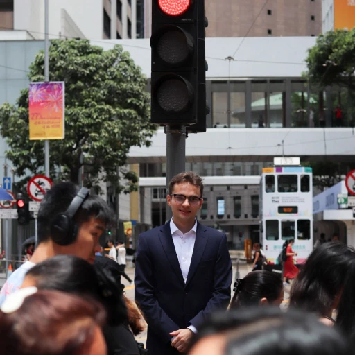

Hi there, my name is Rene Kärkkäinen.

I study Information and Communication Technology with a security-first mindset. Most of my experience and interest has been focused on systems, networks, security and software. I have worked in IT support, infrastructure, security-minded operations and technical teaching, which has given me a broad foundation across different areas of IT.

I am currently pursuing a Bachelor of Engineering in Information and Communication Technology at Metropolia University of Applied Sciences. Outside the classroom, I spend a lot of my time experimenting with my homelab, learning by building, testing and breaking things in a controlled environment.

I also have a strong interest in data centers and one of my long-term goals is to work in one someday. Looking ahead, my top three career goals are to work for the Finnish government, gain experience abroad and possibly be involved in the startup world.

If you wish to reach me, the best way is by email. I read messages regularly.

- Email: [rene@karkkainen.net](mailto:rene@karkkainen.net)
- Phone: [+358 45 333 8778](tel:+358453338778)
- LinkedIn: [linkedin.com/in/renekarkkainen](https://www.linkedin.com/in/renekarkkainen)
- GitHub: [github.com/jaakkq](https://github.com/jaakkq)

If you prefer sending PGP encrypted emails you can find my PGP from [karkkainen.net/pgp.txt](pgp.txt)