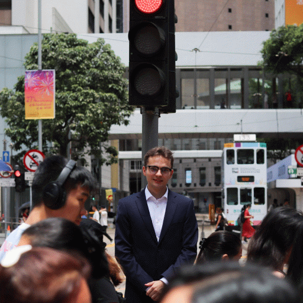

Hey there, my name is Rene! I study information technology with a security-first mindset. Most of my time has gone into systems, networks, security and software. I have worked in IT support, infrastructure, security-minded operations, and technical teaching. 

I am currently studying my Bachelor of Engineering degree on information and communication technology at Metropolia University of Applied Sciences. On my spare time I experiment with my homelab and investment company.

If you wish to reach me, the best way is by email. I read messages regularly.

- Email: [rene@karkkainen.net](mailto:rene@karkkainen.net)
- Phone: [+358 45 333 8778](tel:+358453338778)
- LinkedIn: [linkedin.com/in/renekarkkainen](https://www.linkedin.com/in/renekarkkainen)
- GitHub: [github.com/jaakkq](https://github.com/jaakkq)

If you prefer sending PGP encrypted emails you can find my PGP from [karkkainen.net/pgp.txt](pgp.txt)