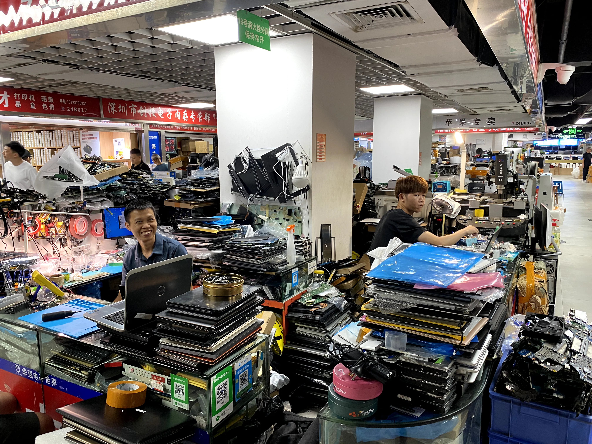
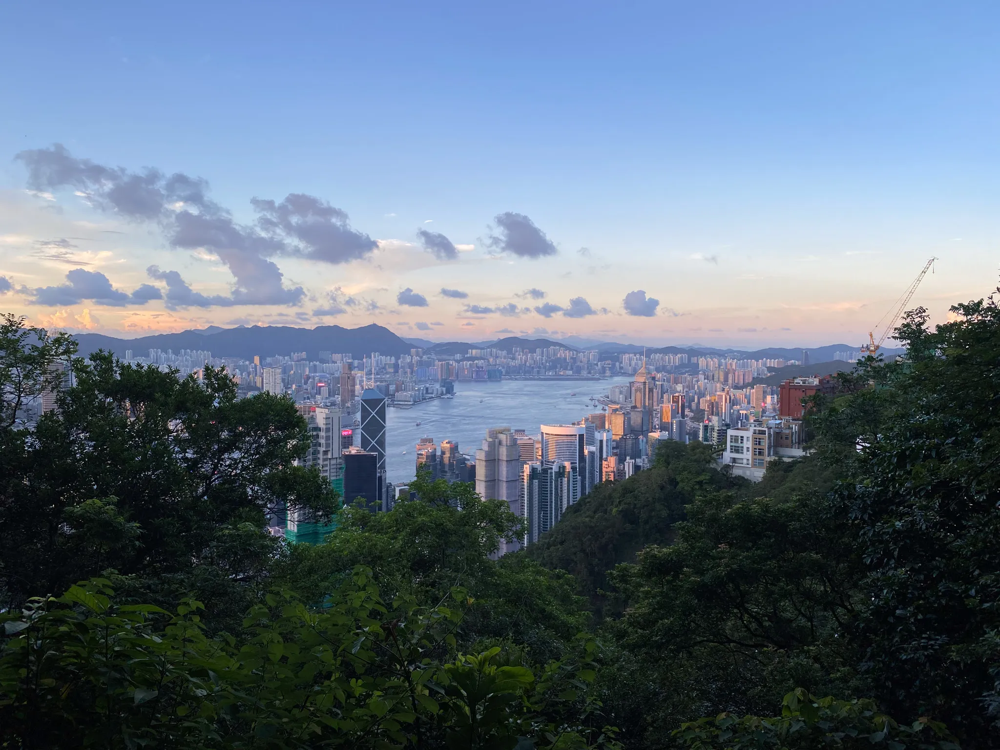
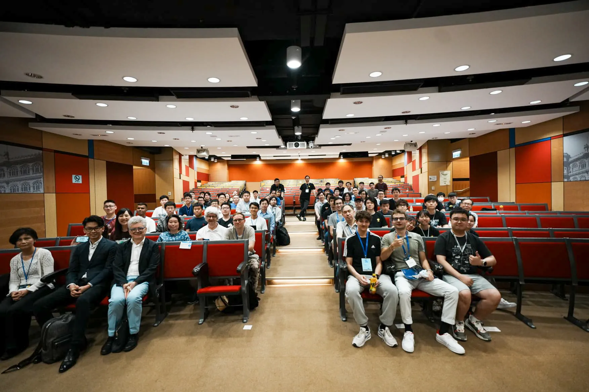

# Exploring Hong Kong

Written by Rene Kärkkäinen on 23.08.2024.

During my summer in Hong Kong, I had the opportunity to work at a food trading company called Nordiska Partners. I got to meet with amazing people from Google, Binance and university students from Peking and Cambridge Universities. Together with those students we even travelled to Shenzhen Mainland China to explore the largest electronic market on earth.

At work, I wore many hats, from troubleshooting technical issues to managing IT. I negotiated contracts with IT vendors, ensuring that the company’s IT systems were secure, efficient and independent. Developing IT strategy provided me with valuable insights into alining IT needs with broader business objectives while balancing technical requirements with financial constraints.

The knowledge and skills I gained during this time extended well beyond IT. The company consists of employees with decades of experience running a business in Asia. I gained a deep understanding of how a business operates, including crucial areas such as the importance of funding, accounting and sales. What this experience impressed on me is that complexity is not a prerequisite for success. A simple business idea, if it meets a real need and is executed well, can be enormously profitable.

If you are considering doing your internship abroad, do it, you won’t regret it. It will open countless doors and provide immense personal and professional growth. For example, I would never have had the chance to meet the brilliant minds from Google, Binance and students from top universities like Peking and Cambridge otherwise. Embrace the opportunity to work abroad and you will experience a world of new possibilities and valuable connections that will shape your future in ways you never imagined.

Lastly, I would like to thank from the bottom of my heart <a href="https://en.bc.fi/" target="_blank">Business College Helsinki</a> for giving me this amazing opportunity. Their support made this incredible journey possible and I am deeply grateful for the chance to grow both personally and professionally during my time in Hong Kong.